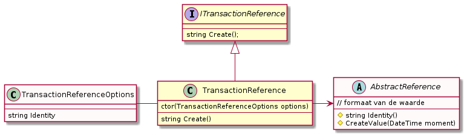

# Transaction Reference

## algemeen

De volgende eigenschappen zijn van belang:

- max 16 karakters
- uniek in tijd en over applicaties/machines
- singleton en thread safe

Deze ```TransactionReference``` wordt gebruikt in (SWIFT) berichtenbverkeer. Elk bericht moet een unieke waarde bevatten.

Echter ook voor interne projecten is deze interessant, bij wijze van correlatie-id.


## opzet

De opzet is om een ```DateTime``` als uitgangspunt te nemen. De huidige tijd (zonder timezones).

De tijd en datum zijn niet het onderwerp en zijn niet relevant op zichzelf. De uniciteit van de waarde is het belangrijkst.

Het idee is om een "semi-leesbare" transaction reference op te leveren, die ook nog uit te spreken en te lezen is in een user interface.

In de waarde zit een vast gegeven verwerkt, een _identity_. Dat bestaat uit 1 of 2 karakters, bij voorkeur een hoofdletter of cijfer. Bijvoorbeeld:
"A", "DB", of "A1".

> Door deze identity per instance van de applicatie en per applicatie te laten verschillen, kunnen unieke waarden worden aangemaakt binnen de origanisatie

## formaat

Het formaat is een datum en een tijd in oplopende volgorde met tussen datum en tijd een _identity_ waarde.

Elke gegenereerde waarde is exact 16 karakters.
De resolutie is 1 milliseconde.

Het formaat ziet er zo uit:

```
    <YYY><DOY><ID><HHMMSSmmm>
```

Voorbeeld: 27 oktober 2021 (dag 300) om 17 uur 45 minuten, 20 seconden en 350 miliseconden. Dan ziet het er zo uit (identity is X):

```
    021300X174520350
```

De volgende elementen

- YYY = het jaartal
  - 4 cijfers (volledig) als er geen _identity_ is meegegeven (niet aan te raden, niet schaalbaar)
  - 3 cijfers (bijv. 021 voor 2021) met een _identity_ van 1 teken. Goed voor ~900 jaar
  - 2 cijfers (bijc 21 voor 2021) met een _identity_ van 2 tekens. Goed voor een eeuw.
- DOY = dag van het jaar. Een waarde tussen 1 en 366. Vervangt dag en maand.
- ID = de _identity_ van 1 of twee tekens
- HHMMSSmmm = uur, minuten, seconden en milliseconden. Aan elkaar, en altijd uit dit aantal tekens (ook bij waarden < 10).


De _day of year_ maakt de datum 1 teken korter dan een MAAND-DAG combinatie en bevat dezelfde informatie.

> Het decimale stelsel is gebruikt om de waarden weer te geven.
> Hexadecimaal kan ook, maar levert op zich weinig winst op (al kan dan wel het volledige jaar meegenomen worden bij een _identity_ van twee tekens)

## ontwerp

Hieronder het class diagram:



De classes zijn net 5.0 (netandard2.0) compatible. Options pattern gebruikt voor ```TransactionReferenceOptions```.

## gebruik

De class ```TransactionReference``` moet als een singleton worden gebruikt.
Dat kan met dependency injection (aan te raden) of eventueel met een expliciet _singleton pattern_ (class afleiden).

```csharp
class Configuration
{
    // willekeurig
    public static IServiceCollection SetupServices(IServiceCollection services, IConfiguration configuration)
    {

            var section = Configuration.GetSection("TransactionReference"); // random name

            services
                .Configure<TransactionReferenceOptions>(section);
                .AddSingleton<ITransactionReference, TransactionReference>();
    }
}
```

De interface kan worden gebruikt in constructors voor de injectie.

In de "options" class wordt de _identity_ meegegeven bij de creatie.

Een nieuwe transaction reference kan worden aangemaakt als volgt, daar waar nodig en thread safe:

```csharp
class SomeService
{
    private readonly ITransactionReference transactionReference;

    public SomeService(ITransactionReference transactionReference)
    {
        this.transactionReference = transactionReference;
    }

    public void RandomCall()
    {
        var txRefValue = transactionReference.Create();

        // use 'txRefValue'
    }
}
```

## werking

Er wordt een ```lock()``` gebruikt om de aanmaak van een waarde thread safe te maken.
Daarnaast wordt er 1 milliseconde gewacht, middels een ```Thread.Sleep(1)``` om te garanderen dat er nooit
op dezelfde tijd een waarde aangemaakt kan worden.

Het aanmaken gaat in een fractie van een milliseconde (enkele nanoseconden), dus bij het snel achter elkaar wordt veelal
dezelfde waarde opgeleverd. De sleep van 1ms verhinderd dat.

De sleep (het wachten) is geen probleem: de resolutie van een timestamp is een milliseconde. Meer dan 1 unieke waarde per milliseconde 
is daarom sowieso niet mogelijk.

De code:

```csharp
public override string Create()
{
    lock (@lock)
    {
        Thread.Sleep(1); // rudimentair:  nooit dezelfde milliseconde opleveren als de vorige keer
        var now = DateTime.Now;

        return CreateValue(now);
    }
}
```

## andere mogelijkheden

- andere resolutie, hoger dan een milliseconde?
- non-blocking methode om een milliseconde te wachten (```Thread.Sleep``` blokkeert - als is het heel kort)
- de "identity" op een andere plaats in de reeks zetten (nu is het tussen datum en tijd deel, maar het zou ook vooraan of achteraan kunnen)
- de waarden niet decimaal, maar hexadecimaal weergeven

In principe is de transaction reference een _case sensitive_ waarde. Voor hexadecimaal maakt dat uit (hoofdletters de voorkeur).


